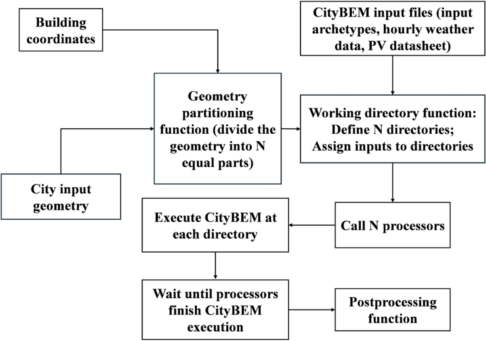

# Run CityBEM V2

CityBEM V2 provides a **fast, robust, and highly scalable execution workflow** for running large-scale UBEM simulations ranging from a few buildings to entire metropolitan regions (300,000+ buildings). This guide explains how to run the executable, manage input files, and scale simulations using parallel workflows.

---

## ⚙️ 1. Running the CityBEM Executable

Once the CityBEM V2 source code is compiled, the build process generates the executable:

```
CityBEM.exe
```

To run the model:

1. Place the executable in a working directory.
2. Ensure that **all required input files** are located in the *same directory*:
    - `Input_City_Scale_Archetype_Construction_Materials_General.txt`
    - `Input_City_Scale_Archetype_Energy_Source.txt`
    - `Input_City_Scale_Archetype_External_Wall_Material.txt`
    - `Input_City_Scale_Archetype_IHG.txt`
    - `Input_City_Scale_Archetype_Slabs_Material.txt`
    - `Input_City_Scale_Archetype_Usage_Type.txt`
    - `Input_City_Scale_Archetype_Year.txt`
    - `Input_City_Scale_Building_Info.txt`
    - `Input_City_Scale_Geometry_CityBEM.stl`
    - `Input_City_Scale_Result_Selection.txt`
    - `Input_City_Scale_Settings.txt`
    - `Input_City_Scale_Cosine_Zenith.txt`
    - `Input_City_Scale_Greenroof_Simulation.txt`
    - `Input_City_Scale_RooftopPV_Panel.txt`
    - `Input_City_Scale_General_Settings.txt`
    - `Input_City_Scale_Parameters_For_RooftopPV_Panel.txt`
    - `Input_City_Scale_Weather_Data.txt`

Then simply run:

```
./CityBEM.exe
```

CityBEM will automatically load all necessary files and start the simulation.

---

## 🧩 2. Folder Structure for Running Simulations

A typical directory for running simulations should look like this:

```
MySimulation/
│── CityBEM.exe
│── Input_City_scale_archetype_construction_materials_general.txt
│── Input_City_scale_archetype_energy_source.txt
│── Input_City_scale_archetype_external_wall_material.txt
│── Input_City_scale_archetype_IHG.txt
│── Input_City_scale_archetype_slabs_material.txt
│── Input_City_scale_archetype_usage_type.txt
│── Input_City_scale_archetype_year.txt
│── Input_City_scale_building_info.txt
│── Input_City_scale_geometry_CityBEM.stl
│── Input_City_scale_result_selection.txt
│── Input_City_scale_settings.txt
│── Input_cosine_zenith.txt
│── Input_data_for_greenroof_simulation.txt
│── Input_data_for_rooftopPV_panel.txt
│── Input_general_settings.txt
│── Input_parameters_for_rooftopPV_panel.txt
│── Input_weatherdata.txt
└── (Output files generated here)
```

CityBEM automatically creates output files based on your Result Selection file.

---

## 🚀 3. Running CityBEM for Large Urban Regions

CityBEM V2 is extremely efficient—**about 2 seconds per building** for a full-year simulation (depending on CPU performance and enabled modules).  
However, for very large geometries (50k–300k+ buildings), **parallel execution** is recommended.

---

## 🧵 4. Parallel Multi-Directory Workflow (Recommended)

To run several segments of a large urban area in parallel:

### **Step 1 — Divide the geometry**
Split your STL geometry into multiple segments, e.g.:

```
geometry_part_1.stl
geometry_part_2.stl
...
geometry_part_N.stl
```

Each file represents a region of your city.

---

### **Step 2 — Create separate directories**

For each region:

```
Sim_A/
│── CityBEM.exe
│── geometry_A.stl
│── all other input files
Sim_B/
│── CityBEM.exe
│── geometry_B.stl
│── all other input files
...
```

Each directory becomes an independent simulation environment.

---

### **:material-cog-play: Step 3 — Use Python to automate parallel runs**

<figure markdown>
  { width="50%" loading=lazy }
  <figcaption>Parallel execution workflow using Python</figcaption>
</figure>

Example Python script snippet:

```python
import os
import subprocess
import threading
import time

# Specify the working directories
working_directories = [
    "D:\\test_run\\1",
    "D:\\test_run\\2",
    "D:\\test_run\\3",
    "D:\\test_run\\4",
    ..................
    ..................
    ..................
]

def run_exe(working_directory, thread_number,result_list):
    start_time = time.time()
    input_1 = os.path.join(working_directory, 'Input_City_scale_archetype_construction_materials_general.txt')
    input_2 = os.path.join(working_directory, 'Input_City_scale_archetype_energy_source.txt')
    input_3 = os.path.join(working_directory, 'Input_City_scale_archetype_external_wall_material.txt')
    input_4 = os.path.join(working_directory, 'Input_City_scale_archetype_IHG.txt')
    input_5 = os.path.join(working_directory, 'Input_City_scale_archetype_slabs_material.txt')
    input_6 = os.path.join(working_directory, 'Input_City_scale_archetype_usage_type.txt')
    input_7 = os.path.join(working_directory, 'Input_City_scale_archetype_year.txt')
    input_8 = os.path.join(working_directory, 'Input_City_scale_building_info.txt')
    input_9 = os.path.join(working_directory, 'Input_City_scale_geometry_CityBEM.stl')
    input_10 = os.path.join(working_directory, 'Input_City_scale_result_selection.txt')
    input_11 = os.path.join(working_directory, 'Input_City_scale_settings.txt')
    input_12 = os.path.join(working_directory, 'Input_cosine_zenith.txt')
    input_13 = os.path.join(working_directory, 'Input_data_for_greenroof_simulation.txt')
    input_14 = os.path.join(working_directory, 'Input_data_for_rooftopPV_panel.txt')
    input_15 = os.path.join(working_directory, 'Input_general_settings.txt')
    input_16 = os.path.join(working_directory, 'Input_parameters_for_rooftopPV_panel.txt')
    input_17 = os.path.join(working_directory, 'Input_weatherdata.txt')
    
    software_path = os.path.join(working_directory, 'CityBEM_v_0.0.0.exe')
    subprocess.run([software_path, input_1, input_2,input_3,input_4,input_5,input_6,input_7,input_8,
                    input_9,input_10,input_11,input_12,input_13,input_14,input_15,input_16,input_17]
                   , cwd=working_directory)
    
    end_time = time.time()
    elapsed_time = end_time - start_time
    
    print(f"Thread-{thread_number}:  did the simulation in {elapsed_time:.2f} seconds. Hello! I'm done.")
    
    # Store the result in the shared result_list
    result_list[thread_number] = elapsed_time


# Create and start threads for each working directory
threads = []
result_list = [0] * len(working_directories)  # Initialize a list to store time results for each thread

for i, directory in enumerate(working_directories):
    thread = threading.Thread(target=run_exe, args=(directory, i,result_list))
    threads.append(thread)
    thread.start()

# Wait for all threads to finish
for thread in threads:
    thread.join()

# Calculate and print the total simulation time
total_simulation_time = max(result_list)/60.
print(f"All processes finished! Total Simulation Time:  {total_simulation_time:.2f} minutes")
```

This launches **multiple CPU cores** running multiple CityBEM simulations simultaneously.

---

## 🌆 5. Scaling to 300,000+ Buildings

Using the multi-directory parallel approach, CityBEM can simulate **entire cities** efficiently:

- Divide into ~100–200 segments
- Run them on multi-core CPUs or cloud servers
- Combine outputs during post-processing

At ~2 seconds per building, even massive metropolitan regions become computable.

---

## 📤 6. After Running — Where Are the Results?

Each directory will generate:

- A consolidated results file  
- (Optional) Separate per-variable time-series files  
- PV outputs  
- Solar irradiance outputs  
- Microclimate-enhanced outputs

These outputs can be directly visualized or imported into GIS dashboards, Python notebooks, or data analytics tools.

---

## 🎯 Summary

CityBEM V2 offers:

- **Simple one-click execution** using the compiled executable  
- **Flexible input management**  
- **High-speed simulation** for small and large-scale studies  
- **Built-in support for parallel execution**  
- **Scalable workflows for entire metropolitan regions**

With proper input preparation and parallel directory structuring, CityBEM can efficiently handle **city-scale UBEM and PV simulations at unprecedented speed**.